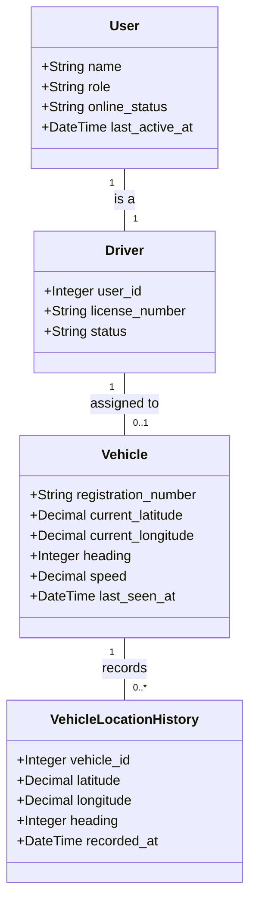

# Live Vehicle Tracking System Documentation

## Overview
The Live Vehicle Tracking System is a high-performance, real-time fleet monitoring solution modeled after industry leaders like Uber and Bolt. It provides administrators with a centralized command center to visualize vehicle positions, monitor telemetry, and audit historical movements.

---

## 1. Database Structure

### Core Tables

#### `vehicles`
Stores the current state and identification of each fleet unit.
- `id`: Primary Key
- `registration_number`: Unique identifier (e.g., GW-101-24)
- `current_latitude` / `current_longitude`: Latest GPS coordinates.
- `heading`: Direction of travel in degrees (0-360).
- `speed`: Current speed in km/h.
- `last_seen_at`: Timestamp of the last telemetry update.
- `assigned_driver_id`: Foreign key to `drivers.id`.

#### `vehicle_location_histories`
Stores granular breadcrumbs for route playback.
- `id`: Primary Key
- `vehicle_id`: Foreign key to `vehicles.id`.
- `latitude` / `longitude`: Historical coordinates.
- `speed`: Speed at that specific point.
- `heading`: Direction at that specific point.
- `recorded_at`: Timestamp of the recording.

#### `users` & `drivers`
Manages identity and professional credentials.
- `users.online_status`: Indicates if a driver is currently active ('online', 'offline').
- `users.role`: Distinguishes between 'admin' and 'driver'.
- `drivers.license_number`: Professional driving credentials.

---

## 2. Class Diagram



---

## 3. Functionalities

### Live Telematics
- **Real-Time Map:** Uses Leaflet.js to render vehicle positions.
- **Dynamic Markers:** Car-shaped SVG icons that rotate in real-time based on the vehicle's `heading`.
- **Follow Mode:** Automatic camera centering on a selected vehicle during movement.

### History Playback
- **Route Visualization:** Polylines represent the path taken by a vehicle over the last 24 hours.
- **Granular Data:** Each point in history captures speed and direction.

### Map Customization
- Supports three professional themes:
    - **Light:** Standard administrative view.
    - **Dark:** Optimized for night shifts and low-light environments.
    - **Satellite:** Provides geographic context for off-road or specific site locations.

---

## 4. Technical UI Implementation

### Frontend Logic
- **Leaflet Integration:** The system uses standard Leaflet markers with a custom `L.divIcon` to host SVG car icons.
- **Smooth Movement:** To replicate the "Uber experience," CSS transitions are applied to the `.leaflet-marker-icon` class. This intercepts Leaflet's `transform: translate3d` updates, resulting in fluid movement instead of "jumping" markers.
  ```css
  .leaflet-marker-icon {
      transition: transform 0.8s linear;
  }
  ```
- **Auto-Refresh:** The dashboard polls the `/vehicles/tracking/data` endpoint every 5 seconds to fetch latest coordinates without full page reloads.

---

## 5. Maintenance & Updates

### Adding New Telemetry Fields
1. Create a migration to add the column to `vehicles`.
2. Update the `VehicleTrackingController@getVehiclesLocations` method to include the new field in the JSON response.
3. Update the `updateUI()` and `updateDetailCard()` functions in `tracking.blade.php` to render the data.

### Modifying Map Themes
Themes are defined in the `mapThemes` object within the script tag of `tracking.blade.php`. You can update URLs to use different tile providers (e.g., Mapbox, Google Maps API).

---

## 6. Use Cases
- **Fleet Optimization:** Identifying idling vehicles or those deviating from assigned regions.
- **Safety Auditing:** Monitoring speed thresholds in real-time.
- **Incident Investigation:** Using history playback to verify a vehicle's location at a specific time.
